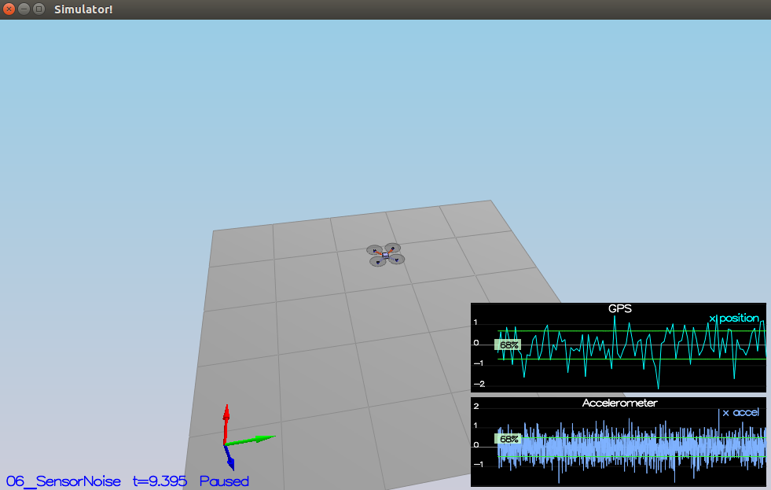
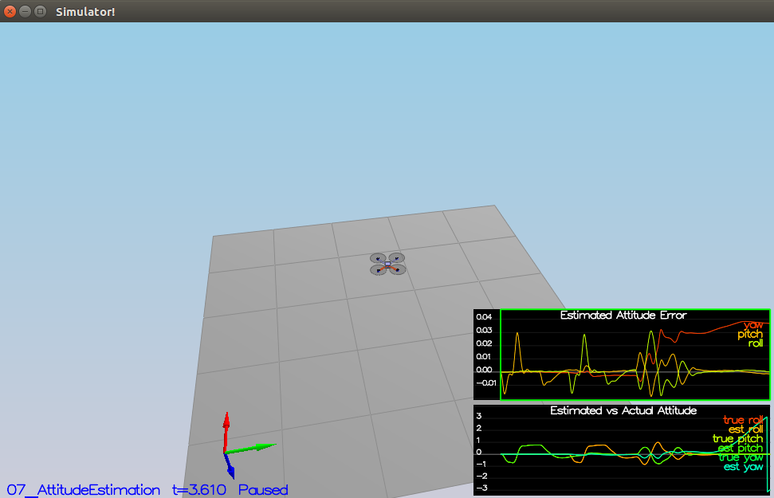
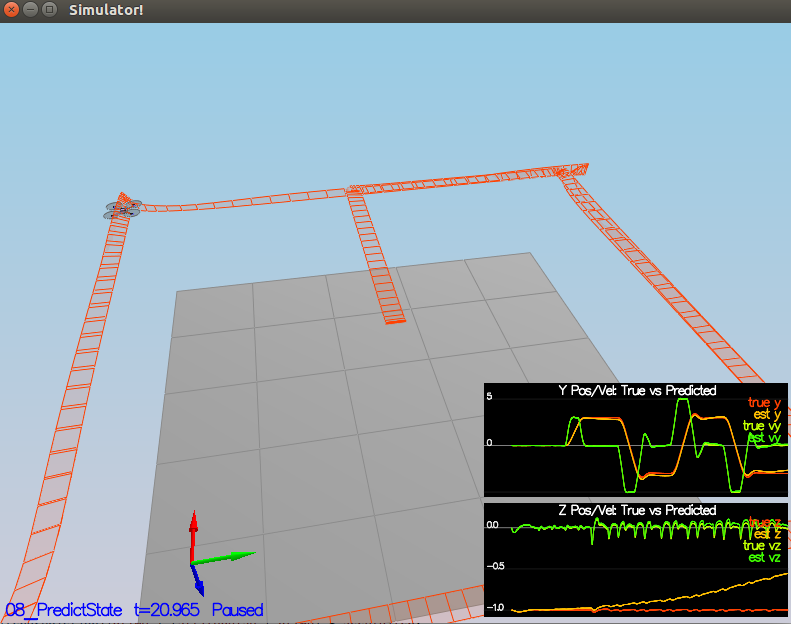
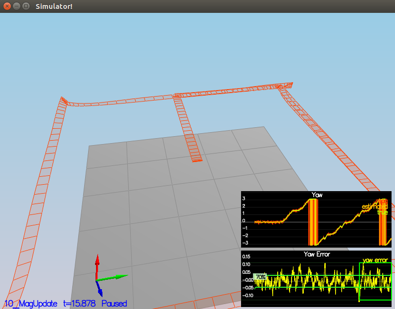
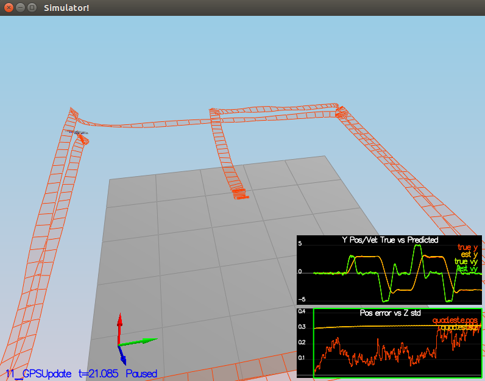

# Estimation Project #

## The Tasks ##

Once again, you will be building up your estimator in pieces.  At each step, there will be a set of success criteria that will be displayed both in the plots and in the terminal output to help you along the way.

Project outline:

 - [Step 1: Sensor Noise](#step-1-sensor-noise)
 - [Step 2: Attitude Estimation](#step-2-attitude-estimation)
 - [Step 3: Prediction Step](#step-3-prediction-step)
 - [Step 4: Magnetometer Update](#step-4-magnetometer-update)
 - [Step 5: Closed Loop + GPS Update](#step-5-closed-loop--gps-update)
 - [Step 6: Adding Your Controller](#step-6-adding-your-controller)

### Step 1: Sensor Noise ###

#### Run scenario `06_SensorNoise`.  

The standard deviation of the GPS and IMU data are calculated with external script which is not included in this project. The result of the calculation could be shown as below

```
MeasuredStdDev_GPSPosXY = 0.6857
MeasuredStdDev_AccelXY = 0.4898
```


***Success criteria:*** *Your standard deviations should accurately capture the value of approximately 68% of the respective measurements.*


### Step 2: Attitude Estimation ###

#### Run scenario `07_AttitudeEstimation`.  

Improved complementary filter-type attitude filter coudd be shown in code snippet.

```
float rollPrediction_deriv, pitchPrediction_deriv, yawPrediction_deriv;

rollPrediction_deriv = gyro.x + tan(pitchEst)*sin(rollEst)*gyro.y + tan(pitchEst)*cos(rollEst)*gyro.z;
pitchPrediction_deriv = cos(rollEst)*gyro.y - sin(rollEst) * gyro.z;
yawPrediction_deriv = (sin(rollEst)/cos(pitchEst))*gyro.y + (cos(rollEst)/cos(pitchEst))*gyro.z;

float pitchPrediction = pitchEst + dtIMU * pitchPrediction_deriv;
float rollPrediction = rollEst + dtIMU * rollPrediction_deriv;
ekfState(6) = ekfState(6) + dtIMU * yawPrediction_deriv;	// yaw

// normalize yaw to -pi .. pi
if (ekfState(6) > F_PI) ekfState(6) -= 2.f*F_PI;
if (ekfState(6) < -F_PI) ekfState(6) += 2.f*F_PI;
```


***Success criteria:*** *Your attitude estimator needs to get within 0.1 rad for each of the Euler angles for at least 3 seconds.*


### Step 3: Prediction Step ###

#### Run scenario `08_PredictState`. 

Code snippet is shown below.

`PredictState` function:
```
predictedState[0] += predictedState[3]*dt;
predictedState[1] += predictedState[4]*dt;
predictedState[2] += predictedState[5]*dt;

V3F rotated = attitude.Rotate_BtoI(V3F(accel.x*dt,accel.y*dt,accel.z*dt));

predictedState[3] = predictedState[3] + rotated.x;
predictedState[4] = predictedState[4] + rotated.y;
predictedState[5] = predictedState[5] + rotated.z - 9.81f*dt;
predictedState[6] = curState(6);
```

`GetRbgPrime` function:
```
RbgPrime(0,0) = -cos(pitch)*sin(yaw);
RbgPrime(0,1) = -sin(roll)*sin(pitch)*sin(yaw) - cos(roll)*cos(yaw);
RbgPrime(0,2) = -cos(roll)*sin(pitch)*sin(yaw) + sin(roll)*cos(yaw);

RbgPrime(1,0) = cos(pitch)*cos(yaw);
RbgPrime(1,1) = sin(roll)*sin(pitch)*cos(yaw) - cos(roll)*sin(yaw);
RbgPrime(1,2) = cos(roll)*sin(pitch)*cos(yaw) + sin(roll)*sin(yaw);

RbgPrime(2,0) = 0;
RbgPrime(2,1) = 0;
RbgPrime(2,2) = 0;
```

`Predict` function:
```
gPrime(0,3) = dt;
gPrime(1,4) = dt;
gPrime(2,5) = dt;
gPrime(3,6) = (RbgPrime(0,0)*accel.x + RbgPrime(0,1)*accel.y + RbgPrime(0,2)*accel.z)*dt;
gPrime(4,6) = (RbgPrime(1,0)*accel.x + RbgPrime(1,1)*accel.y + RbgPrime(1,2)*accel.z)*dt;
gPrime(5,6) = (RbgPrime(2,0)*accel.x + RbgPrime(2,1)*accel.y + RbgPrime(2,2)*accel.z)*dt;

ekfCov = gPrime * ekfCov * gPrime.transpose() + Q;
```

The new value of the parameters `QPosXYStd` and `QVelXYStd` are:

```
QPosXYStd = .01
QVelXYStd = .30
```


***Success criteria:*** *This step doesn't have any specific measurable criteria being checked.*


### Step 4: Magnetometer Update ###

####  Run scenario `10_MagUpdate`. 
Magnetometer update function and yaw normalize are shown below.

```
hPrime(0,6) = 1;
zFromX(0) = ekfState(6);
float diff = z(0) - zFromX(0);
// normalize yaw to -pi .. pi
if (diff > F_PI) z(0) -= 2.f*F_PI;
if (diff < -F_PI) z(0) += 2.f*F_PI;
```

***Success criteria:*** *Your goal is to both have an estimated standard deviation that accurately captures the error and maintain an error of less than 0.1rad in heading for at least 10 seconds of the simulation.*




### Step 5: Closed Loop + GPS Update ###

####  Run scenario `11_GPSUpdate`.  
`Quad.UseIdealEstimator` parameter in `11_GPSUpdate.txt` is set to 0 in order to use my estimator implementation. Also, these two lines are commented out to add noise on the sensor data.

```
#SimIMU.AccelStd = 0,0,0
#SimIMU.GyroStd = 0,0,0
```

`UpdateFromGPS` function is implemented as shown below.

```
hPrime(0,0)=1;
hPrime(1,1)=1;
hPrime(2,2)=1;
hPrime(3,3)=1;
hPrime(4,4)=1;
hPrime(5,5)=1;

zFromX(0) = ekfState(0);
zFromX(1) = ekfState(1);
zFromX(2) = ekfState(2);
zFromX(3) = ekfState(3);
zFromX(4) = ekfState(4);
zFromX(5) = ekfState(5);
```

***Success criteria:*** *Your objective is to complete the entire simulation cycle with estimated position error of < 1m.*



### Step 6: Adding Your Controller ###

#### Run scenario `11_GPSUpdate`. 

In the final task, two necessary files, `QuadController.cpp` and `QuadControlParams.txt`, are replaced with the version of the previous project. 


***Success criteria:*** *Your objective is to complete the entire simulation cycle with estimated position error of < 1m.*
